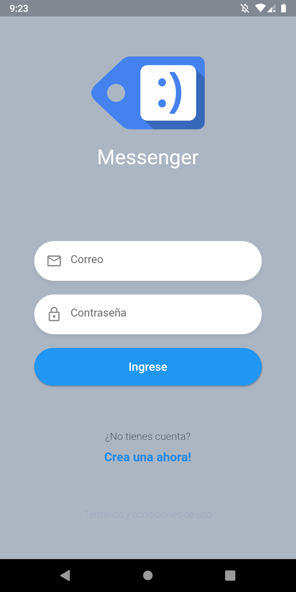
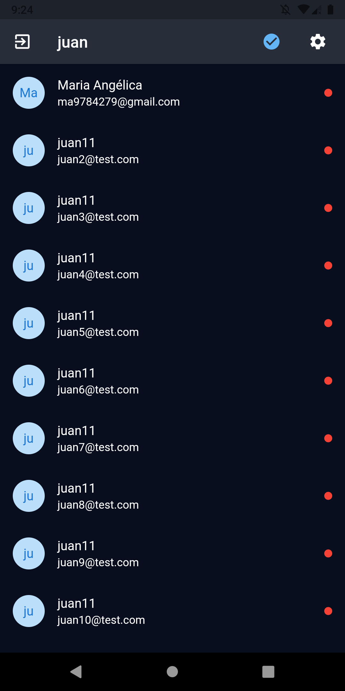
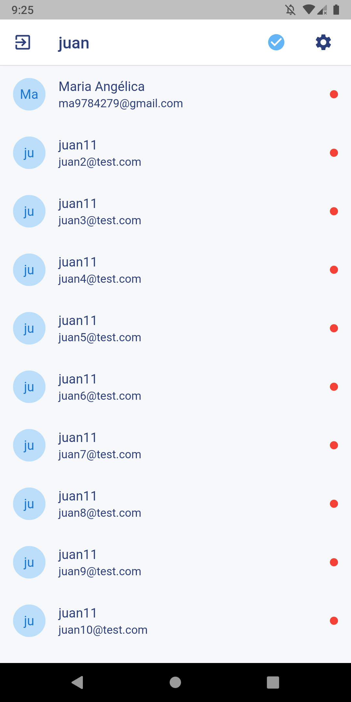

# chat

A new chat in Flutter project, developed in fernando herrera course (advanced flutter) and added other functionalities like set theme in runtime.

Final result.

Screenshots: 
<table>
<tr>
<td></td>
<td></td>
<td></td>
</tr>
</table>

## Getting Started

Just git clone and update the proyect with flutter pub get
